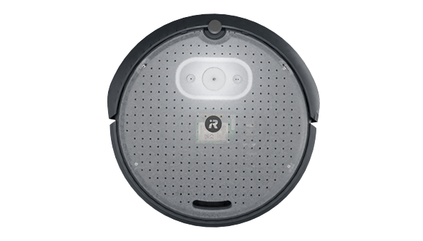
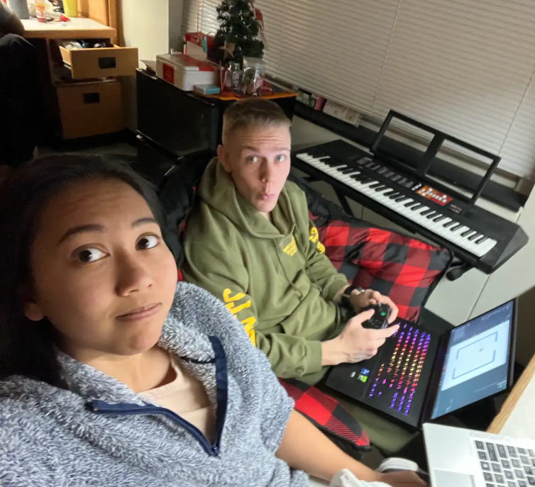

# Introduction: A Noble Thank You for Joining Us on This Quest!

Hark! Fair traveler, thou art most welcome to the grand unveiling of our humble work—*a tale of wonder and innovation*! We, Camren and Bella, extend our heartfelt thanks for taking the time to gaze upon our portfolio, which doth present the movement of the noble Create3 robot, as it embarks on its most daring adventure: mapping an area through the ancient art of LIDAR and the powerful connection known as ROS (Robot Operating System).

## What is the Create3 Robot?
Lo and behold, the Create3 robot! A mechanical steed of great precision, crafted by the masters at iRobot. With sensors sharp and wheels swift, this wondrous device aids in the noble task of autonomous navigation, proving itself a worthy companion for any robotic quest. It is a marvel of engineering, ready to chart the unknown and conquer challenges with its intelligence.



## What is ROS?
Ah, ROS—Robot Operating System! A magical framework, open to all, that binds the various elements of the robotic realm together. Through its power, the Create3 can communicate with its mighty LIDAR and other enchanted sensors, performing feats of mapping and localization with great finesse. A true marvel of the modern age!

So, brave soul, as you journey through this portfolio, prepare to witness how we harnessed the might of ROS and the Create3 robot to map an area in a wondrous display of technological prowess!

## Dependencies 
Thou shall need the following:
- Python
- roslibpy
- Create3 Robot
- Summon the power of thy mind! 

## Prepare They Scrolls 
Use the `pip install` for any installation of programs.

This will install the lastest version of the [Python ROS Bridge library](https://pypi.org/project/roslibpy/)
`pip install roslibpy`

This will install the latest version of the [Python Pygame library](https://pypi.org/project/pygame/)
`pip install pygame`

## How to Run
### The Arcane Script: Pseudocode of the Mapping Rite
```python
# Begin the Ritual
import roslibpy
import math

# Connect to the mighty ROS Bridge
client = roslibpy.Ros(host='ip address', port=9012)
client.run()

robot_name = 'name'

# Summon the LIDAR and Odometry and initialize its vision
mapper_topic = roslibpy.Topic(client, f'/{robot_name}/mapper', 'nav_msgs/OccupancyGrid')
lidar_topic = roslibpy.Topic(client, f'/{robot_name}/scan', 'sensor_msgs/LaserScan')
odom_topic = roslibpy.Topic(client, f'/{robot_name}/odom', 'nav_msgs/Odometry')

# Create a blank scroll to record the map
grid_width = 500
grid_height = 500
resolution = 0.1
occupancy_grid = [-1] * (grid_width * grid_height)

# Whilst the Create3 doth roam:
     # Gather distance and angle from LIDAR's gaze
     def lidar_callback(msg):
        global occupancy_grid
     # Translate these into sacred coordinates
     # Mark these coordinates on the map-scroll
     # Update the display for the realm revealed

# When the journey ends:
     # Save the scroll for future sages
     # Close the connection to the mechanical beast
    lidar_topic.unsubscribe()
    odom_topic.unsubscribe()
    mapper_topic.unadvertise()

# End the Ritual
client.terminate()

```
### Glimpse of the Cartographer's Triumph 
This is where we insert images of the example map

# Tale of the Creators
<table border="0">
 <td style="text-align: center;">
      <b style="font-size:30px">Cam Ross</b><br />
      
    </td>
    <td style="text-align: center;">
      <b style="font-size:30px">Bella Rubijono</b><br />
      
    </td>
 <tr>
    <td class = "parchment-text">"The Tale of Cam Ross, Seeker of Knowledge and Sky"

Hark! Gather ye 'round, for I shall recount the tale of Cam Ross, a noble soul of great ambition and skill. A senior at the esteemed Naval Academy, he doth study the sacred arts of Robotics and Control Engineering, mastering the very forces that govern machines with wisdom beyond his years. Yet, his journey doth not end in mere mastery of circuits and gears!

Upon graduation, Cam shall don the wings of a Marine Corps pilot, soaring through the skies as a guardian of the heavens, commanding the winds with the same skill he wields in the realm of robotics. But lo, even the mightiest of warriors must find respite! In the hours of quiet, Cam doth indulge in the games of the mind, lost in the fantastical realms of video games and the camaraderie of his friends in the legendary battles of Dungeons & Dragons.

Thus, the tale of Cam Ross is one of both intellect and adventure, a seeker of knowledge by day and a champion of camaraderie by night. Truly, his path is one of both wisdom and valor!</td>
    <td class = "parchment-text">"The Ballad of Bella Rubijono, Mistress of Machines and Melody"

Lo! Attend, ye listeners, to the tale of Bella Rubijono, a scholar of unmatched grace and intellect, who walks the hallowed halls of the Naval Academy as a senior in the noble study of Robotics and Control Engineering. With hands steady and mind sharp, she doth wield her knowledge of machines, taming the intricate dance of gears and circuits with a mastery that promises great feats.

Yet, her path is not solely bound to the land of wires and code, for upon her graduation, Bella shall rise to the rank of Surface Warfare Officer, embracing the call of duty upon the seas. With the esteemed Engineering Duty Officer (EDO) option, she shall command the very engines that propel the mighty vessels of the fleet, her wisdom guiding their course.

But behold! Even the fiercest of warriors must find solace in their passions. Bella, when not commanding the realms of robotics and the waves, finds joy in the delicate art of handicrafts, weaving threads through crochet with deft fingers. Her voice, too, doth soar in song, filling the air with melodies as sweet as the winds. And, as night falls, she doth retreat into the realms of video games, where epic quests and battles unfold before her eyes.

Thus, the tale of Bella Rubijono is one of both intellect and creativity, a master of machines by day and a poet of song and craft by night. Truly, she is a force to be reckoned with, both on land and sea!</td>
 </tr>
</table>



# 🎻 A Final Note of Gratitude
And so, dear traveler, thou hast reached the journey’s end.

With humble hearts and joyous spirits, we—Cam and Bella—offer thee our sincerest thanks for walking beside us through this tale of machines and magic, of gears and glyphs, of code and courage. Thy time is a treasure, thy curiosity a gift most rare.

May the knowledge herein serve thee well on thine own quests, and may thy days be filled with wonder, discovery, and the noble pursuit of learning.

Should fate guide our paths to cross again, know that thou art ever welcome at our hearth.

Until then…

Go forth with honor. Create boldly. Map bravely.

🕯️ Finis.