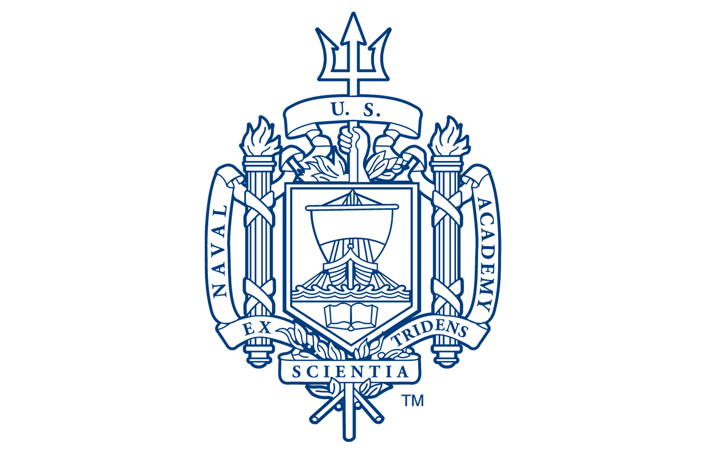

<!-- markdownlint-disable first-line-h1 -->

  
  
  <h1 >EW458 Section 3331</h1>
  
  <h2> Programming & Planning for Mobile Robots</h2>

  <ul style="list-style-type: none; padding: 0; font-family: 'IM Fell English', serif;">
    <li style="font-size: 20px;">MIDN 1/C Camren Ross</li>
    <li style="font-size: 20px;">MIDN 1/C Bella Rubijono</li>
    <li style="font-size: 20px;">Foolish Attempts of Code Between WERC Majors</li>
  </ul>

  

    <a href="#docsify" style="color: white; font-size: 20px; text-decoration: none; padding: 10px 20px; background-color: #D4A59D; border-radius: 10px; margin-right: 20px;">Get Started</a>
    <a href="https://github.com/CamRoss25/12WeekSpecial.git" style="color: white; font-size: 20px; text-decoration: none; padding: 10px 20px; background-color: #D4A59D; border-radius: 10px;">GitHub</a>
  

